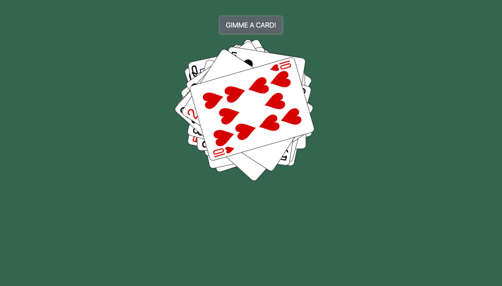

### Deck of Cards

#### Functionality

- This is a simple exercise, where a deck is assigned to the user when they arrive to the page. The user can then ask for a card and it will be displayed on the screen until the deck is empty. Once the deck is empty the button will disappear.
- Note that this exercise utilizes promises in two ways. 
  1. In the first, I use a promise to make a call to the [deck of cards api](http://deckofcardsapi.com/) so that I can get a deck ID and **then** use that deck id to configure the deck url.
  2. In the second way, I use a promise to make a call using the deck url and **then** once this call is resolved, I begin putting the card on the page and adding css to it.

### Technicalities

- To have this code on your computer, run: `git clone https://github.com/jlh040/JS-Promises-Part2.git` .